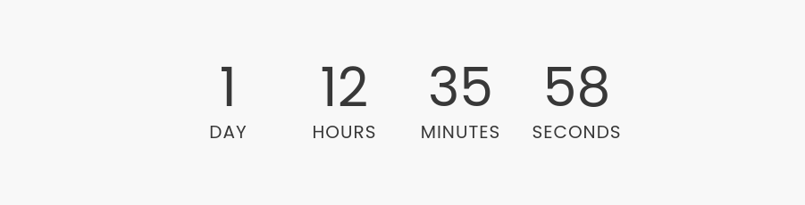

# Simple Countdown Block for Wordpress

A Gutenberg block showing a countdown with days, hours, minutes, and seconds until a target date.

Choose:
* Target date and time
* Text and background colors

Uses theme font.

Labels are singular or plural depending on number.

